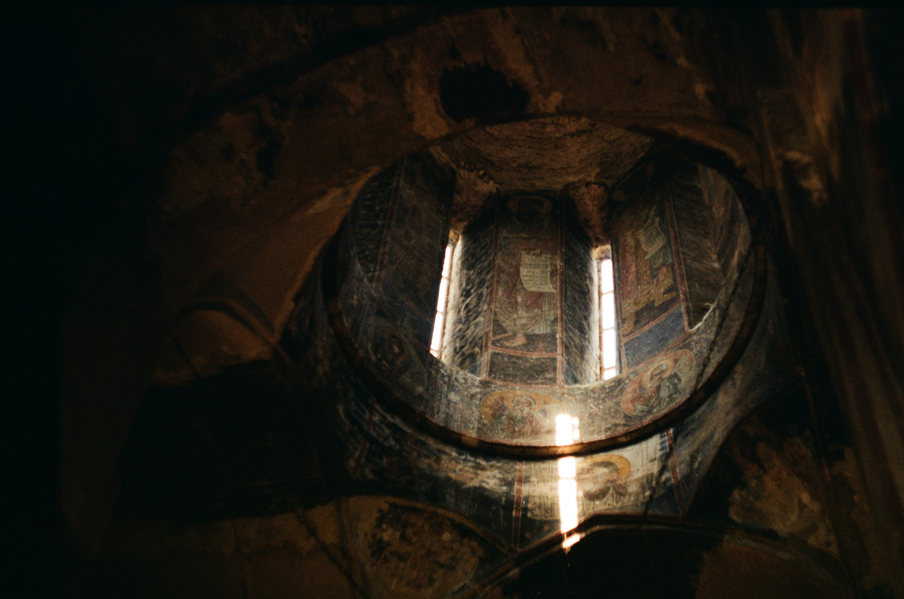
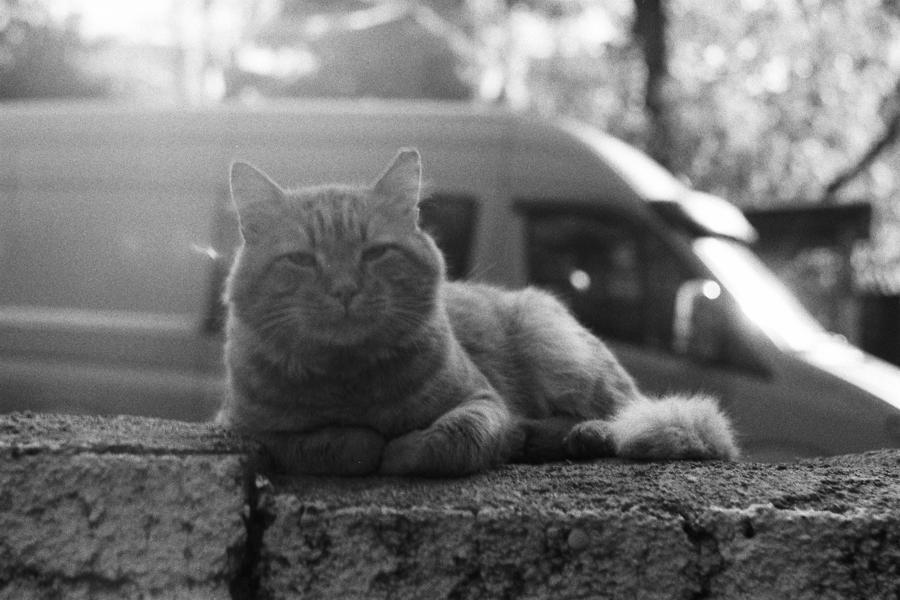
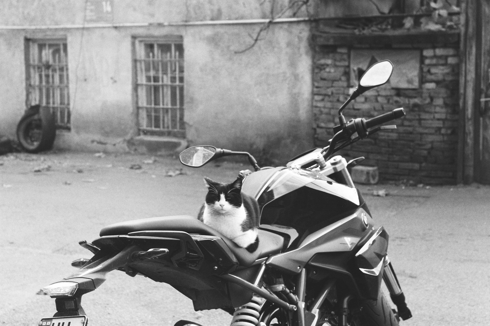
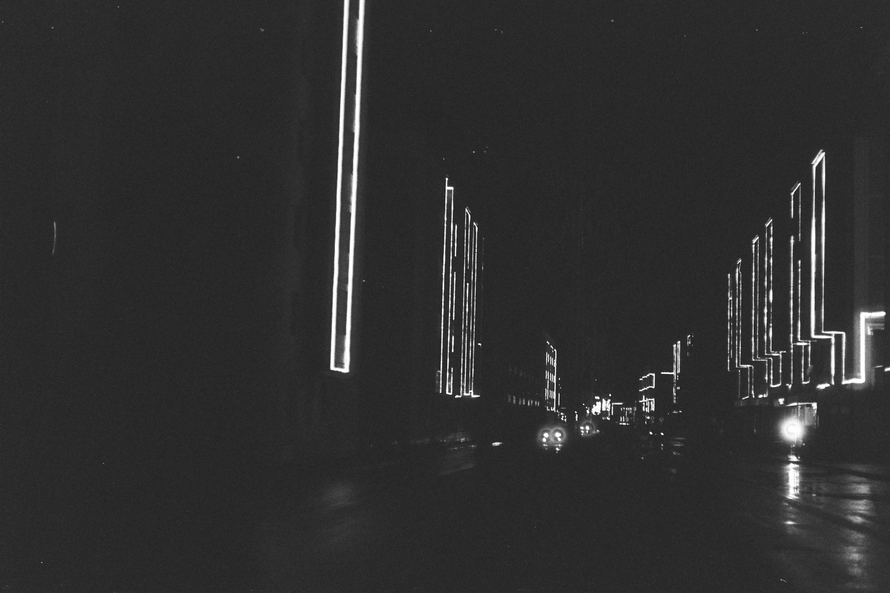
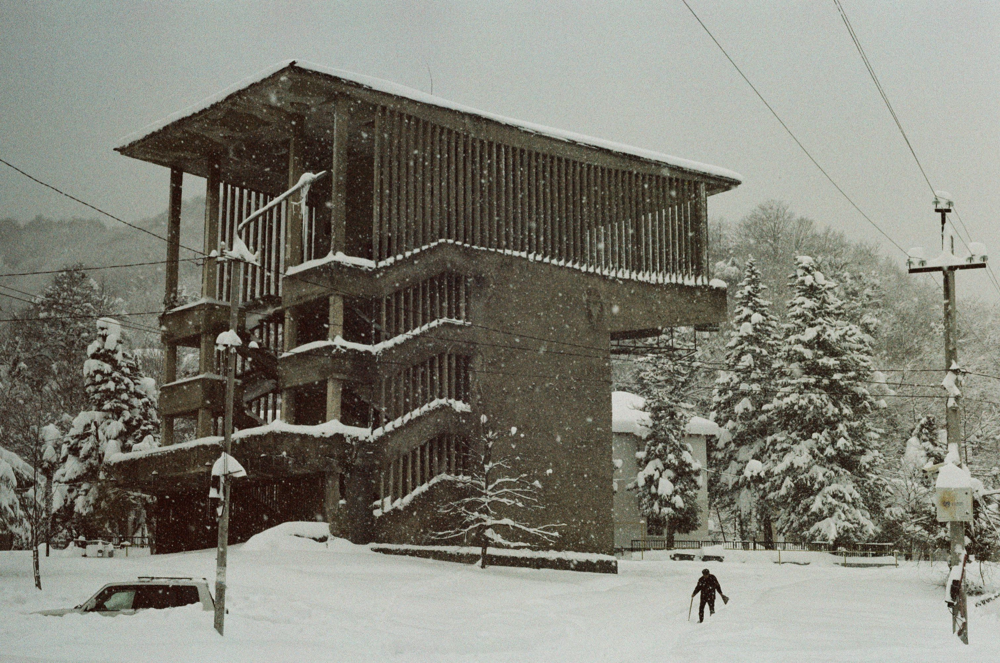
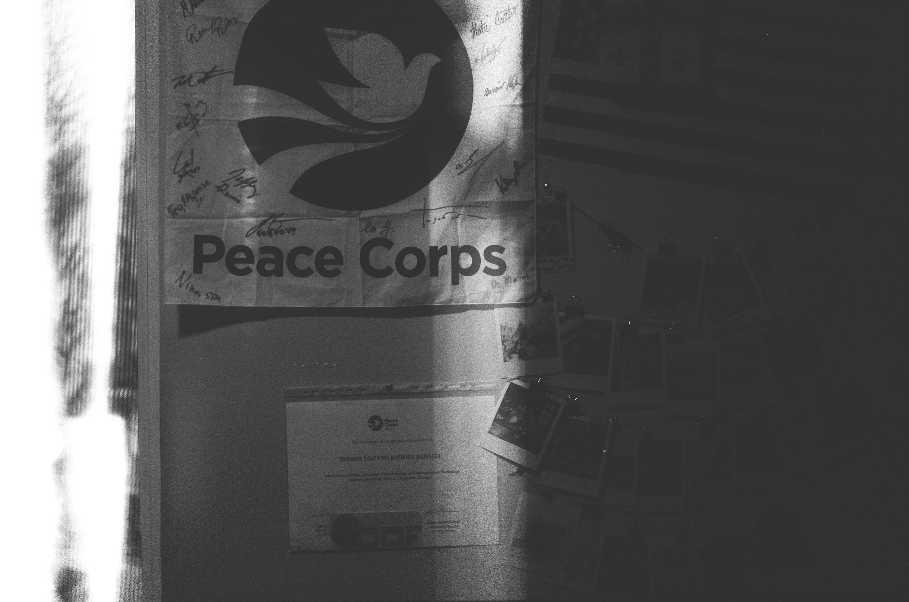
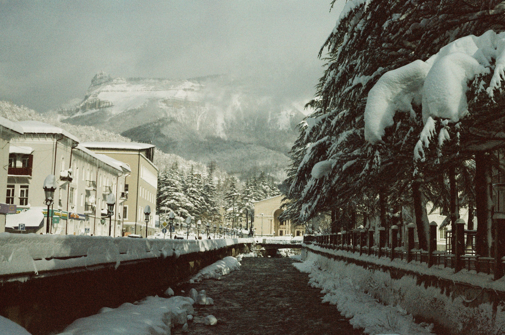

::: {.scene}
{.full-img}

Georgian 14th Century Church  
A quiet moment before the day began.

:::

::: {.scene}
{.full-img}

Summer Time Lounging  
The neighborhood cats always knew the best places to rest.

:::

::: {.scene}
{.full-img}

Mestia and Svan Towers  
A landscape where cows and mountains share the same calm.

:::

::: {.scene}
{.full-img}

Rallying for a Ride  
A cat with somewhere important to be.

:::

::: {.scene}
{.full-img}

Berikaoba Mtchadi  
Warm bread, cold air, and the feeling of celebration.

:::

::: {.scene}
{.full-img}

Evening Walks in Tkibuli  
Streetlights, quiet roads, and the rhythm of small‑town nights.

:::

::: {.scene}
{.full-img}

An Experience at Berikaoba  
Tradition, color, and the energy of community.

:::

::: {.scene}
{.full-img}

Winter in Georgia  
Snow‑covered hills and the slow hum of daily life.

:::

::: {.scene}
{.full-img}

Inside the Tkibuli Office  
Where projects began, conversations unfolded, and ideas took shape.

:::

::: {.scene}
{.full-img}

Racha and Imereti is the Place to Be  
A region that shaped my service and my memories.

:::
